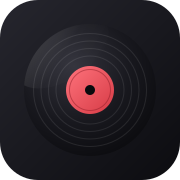
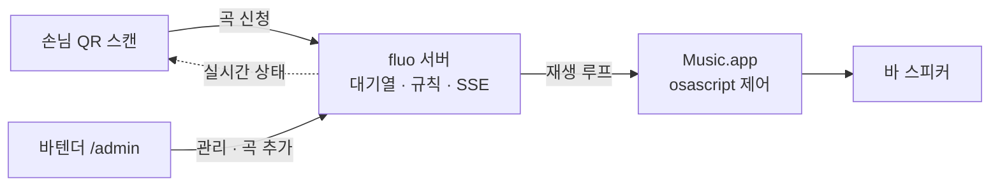

<div align="center">
  
  <h1>🎵 바 주크박스</h1>
  <p><b>손님은 QR로 신청하고, 바의 Mac에서 Apple Music으로 틀어주는 주크박스</b></p>
  <p>
    
    
    
    
  </p>
</div>

---

## ✨ 한눈에 보기

| | 무엇을 하나요 |
|---|---|
| 📱 **손님 화면** (`/?t=<테이블>&k=<시크릿>`) | 테이블 QR 스캔 → 곡 검색·신청 → 하단 미니플레이어에서 재생 상태 확인 → 시트에서 대기열 확인·본인 곡 취소 |
| 🎛️ **바텐더 화면** (`/admin`) | 재생/대기열(드래그 순서 변경) 관리, 곡 추가, 테이블 & QR 생성·인쇄, 신청 일시중지·공지·곡 수 제한 설정 |
| 🎧 **재생 루프** | `osascript`로 Music.app을 제어해 **요청 곡 하나만** 순서대로 재생 |
| ⚡ **실시간** | SSE(`/api/events`)로 재생 상태·대기열 변경을 손님 화면에 즉시 반영 (폴링 폴백 내장) |
| 💾 **영속화** | 큐·히스토리·재생중·설정·테이블을 SQLite에 저장 — 서버를 재시작해도 이어짐 |

## 🎧 동작 흐름



1. 손님이 테이블 QR을 스캔하면 서버가 발급한 기기 쿠키(`bj_did`)로 신원을 확인해요.
2. 신청은 대기열에 **요청 곡 1곡**만 들어가고, 규칙(중복·곡 수 제한)을 통과한 곡만 쌓여요.
3. 재생 루프가 대기열에서 다음 곡을 꺼내 Music.app으로 재생하고, 곡이 끝나면 다음 곡으로 넘어가요.

> **재생 방식에 대하여** — Music.app은 `music://` 앨범 주소로 열면 앨범 전체가 재생 대기열에 들어가지만,
> 뮤트 상태에서 목표 트랙까지 스킵한 뒤 `play once`로 요청 곡 1곡만 남기도록 처리해요.
> 재생 위치는 1초 간격으로 SSE에 실시간 반영돼요.

## 📐 신청 규칙

| 규칙 | 기본값 | 설명 |
|---|---|---|
| 기기(1인)당 곡 수 | **1곡** | 재생중 + 대기 합산. 도달하면 신청 버튼이 잠겨요 |
| 테이블당 곡 수 | **5곡** | 같은 테이블의 모든 기기를 합산해 세요 |
| 중복 트랙 | 차단 | 이미 재생중/대기 중인 같은 곡은 다시 신청할 수 없어요 |
| 본인 곡 취소 | 허용 | 손님이 자기 기기의 대기 곡을 직접 취소할 수 있어요 |
| 바텐더 곡 추가 | 무제한 | `/admin`의 곡 추가는 제한을 건너뛰어요 |

두 제한은 어드민 **운영 설정**에서 언제든 바꿀 수 있어요. `0`을 넣으면 무제한이에요.

## ⚠️ Music.app 자동 재생 끄기 (꼭 한 번!)

> Music.app → 설정 → 재생에서 **자동 재생(비슷한 노래 이어 재생)을 꺼주세요.**
> 켜져 있으면 요청 곡이 끝난 뒤 추천 곡이 대기열에 이어서 쌓입니다.
> 이 설정은 AppleScript로 바꿀 수 없어 수동으로 꺼야 해요.

꺼두지 않아도 추천 곡이 스피커로 나오지 않게 서버가 막지만, 대기열이 깔끔해지려면 꺼두는 게 좋아요.

## 🚀 시작하기

바의 Mac에서 (Apple Music 구독 계정으로 Music.app 로그인 상태):

```bash
git clone https://github.com/ayden94/bar-jukebox.git
cd bar-jukebox
bun install
cp .env.example .env      # ADMIN_TOKEN을 긴 랜덤 문자열로 변경!
bun run build             # 클라이언트 + 서버 빌드
bun start
```

- 🎛️ 바텐더: `http://localhost:5173/admin` — 비밀번호는 `.env`의 `ADMIN_TOKEN`
- 📱 손님: 어드민에서 만든 테이블 QR 스캔 (같은 Wi-Fi)
- 🧪 API 플로우 점검: `ADMIN_TOKEN=<토큰> bun test-flow.ts`

## ⚙️ .env

```bash
ADMIN_TOKEN=긴-랜덤-문자열
PORT=5173

# QR에 인쇄될 공개 주소 (미설정 시 LAN IP 자동 감지)
# BASE_URL=http://barjukebox.local:5173
```

> **QR은 한 번 인쇄하면 유지**돼요. 서버 주소가 바뀌면 재인쇄가 필요하니 `BASE_URL`로
> 고정 호스트명(mDNS 등)을 쓰는 걸 권장해요.

## 🗂 프로젝트 구조

```
src/
├── main.ts             # 서버 부팅: SQLite 복원 → 앱 기동 → 재생 루프
├── app.tsx             # 라우터·컨트롤러·미들웨어·React 페이지 연결
├── domains/            # queue / table / settings / search / playback / events / admin
│                       #   controller → service → repository (도메인 규칙은 service에)
├── infra/              # drizzle-orm/libsql 클라이언트 + 스키마
├── middleware/         # 기기 식별 쿠키 (bj_did)
└── pages/              # 손님·관리자 React UI (SSR + hydration)
```

## ✅ 검증

```bash
bun test               # 단위 테스트 (큐 규칙 · 저장소 round-trip · 재생)
bun run typecheck      # TypeScript strict
bun run check          # Biome lint + format
bun run dev            # 개발 서버 (fluo dev)
```

## 📚 문서

| 문서 | 내용 |
|---|---|
| [`docs/plan-local.md`](docs/plan-local.md) | 로컬 트랙 설계 |
| [`docs/plan-migration.md`](docs/plan-migration.md) | fluo/React 마이그레이션 계획 |
| [`docs/plan-cloud.md`](docs/plan-cloud.md) | 클라우드 SaaS 트랙 (재생은 항상 현장 기기) |
